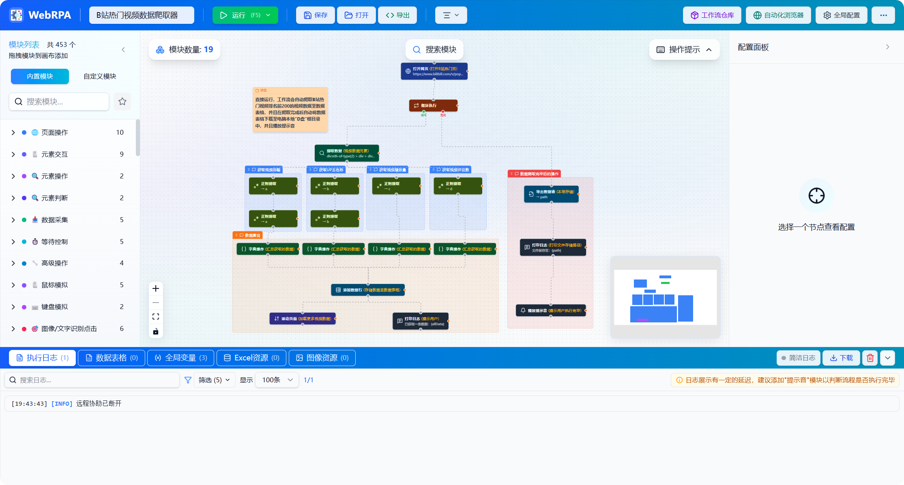
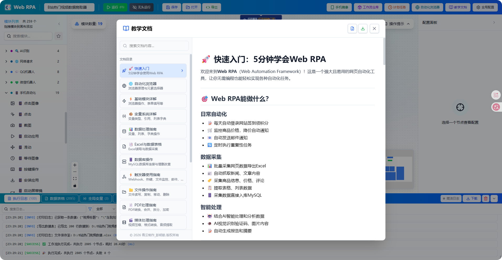
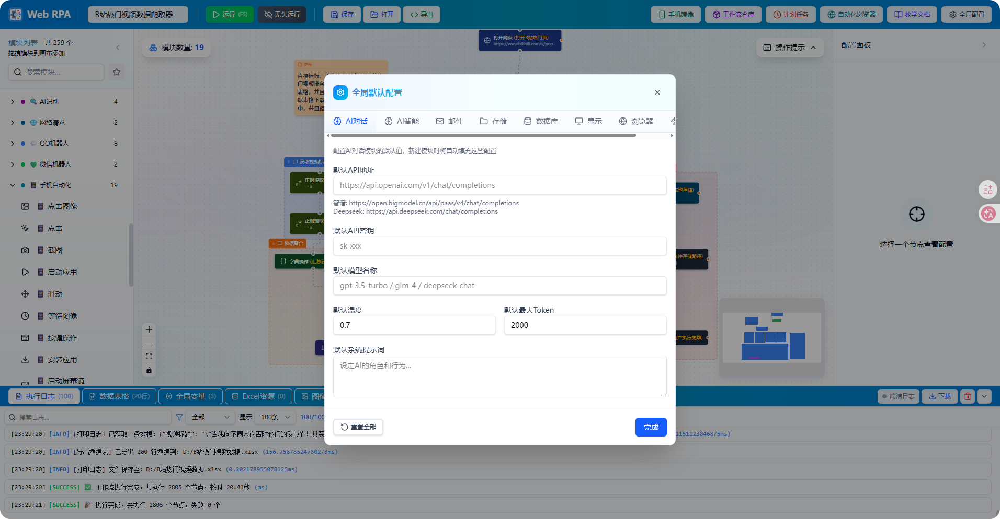
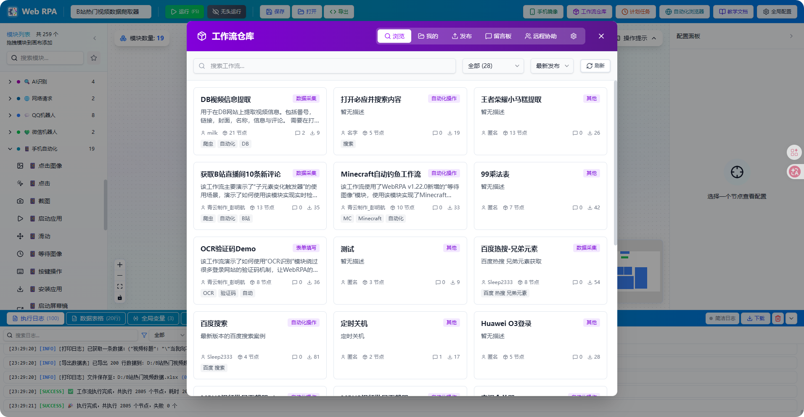
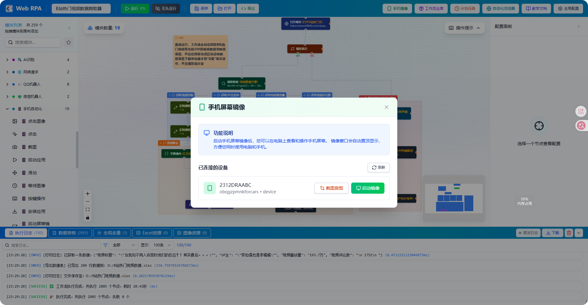
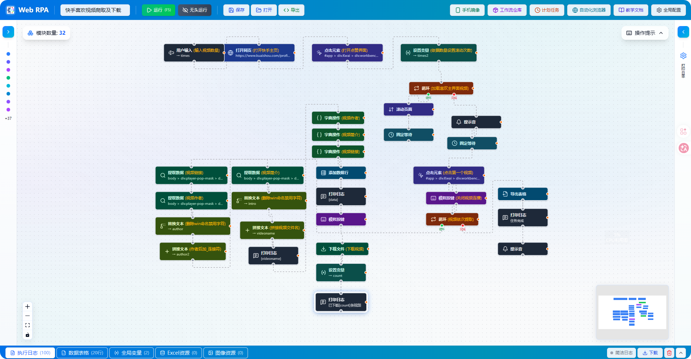
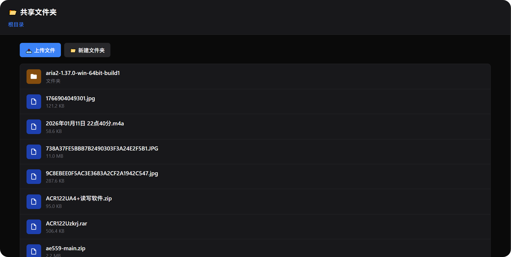

<div align="center">
    
</div>
<h1 align="center">
WebRPA - 网页机器人流程自动化工具
</h1>
<p align="center">
  
  
  
  
  
  
  
</p>
**一款功能强大的可视化网页自动化工具（支持一定的Windows系统桌面自动化和Android系统自动化），通过拖拽模块的方式快速构建自动化工作流，无需编写代码即可实现网页数据采集、表单填写、自动化测试等任务。**

> **⚠️ 重要声明：本软件仅作为技术工具提供，用户必须遵守法律法规，开发者对用户的使用行为不承担任何责任。详见[免责声明](#️-免责声明)。**

> **【请到Releases中下载最新7z压缩包，最新源代码和运行环境都在里面，解压即可使用！😇】**
>
> 赞助支持WebRPA的开发工作：[爱发电主页](https://ifdian.net/a/qypmh)

## ✨ 功能特性

### 🎯 核心优势

- **🚀 零代码开发**：可视化拖拽，无需编程基础
- **📦 开箱即用**：内置Python、Node.js环境，一键启动
- **🔧 模块丰富**：453个功能模块，覆盖90%自动化场景
- **🎨 界面美观**：现代化UI设计，Motion动效灵动，操作流畅，支持Mermaid流程图
- **⚡ 性能强劲**：基于FastAPI + React，响应迅速
- **🔌 易于扩展**：模块化架构，支持自定义开发
- **📚 文档完善**：31篇详细教学文档，覆盖所有453个模块分类
- **🆓 完全免费**：非商业使用完全免费，开源透明
- **🔍 智能搜索**：模块和教学文档支持中文、拼音、拼音首字母模糊搜索
- **📊 可视化流程**：内置Mermaid流程图，直观展示工作流逻辑
- **💾 变量自动补全**：创建模块时自动添加默认变量名到自动补全列表
- **🌐 完全离线**：所有资源本地化，无需外网连接，完美支持局域网部署

---

## 🖼️ 界面预览

工作流编辑器采用可视化拖拽设计，左侧模块列表，中间画布区域，右侧配置面板，底部日志/数据/变量面板等



---



---



---



---



---



---



------


------

## 🚀 快速开始

### 环境要求

- Windows 10/11（本项目仅支持Windows系统使用）
- 项目自带 Python 3.13 和 Node.js（无需额外安装）

### 启动方式

在Releases中下载最新版7z压缩包，之后解压出来，使用 `WebRPA启动器.exe` 启动本项目：

1. 双击运行 `WebRPA启动器.exe`
2. 在启动器中可以配置后端和前端的端口号
3. 点击"启动 WebRPA"按钮即可启动服务
4. 启动器会自动打开浏览器访问前端界面

默认访问地址：
- 后端服务：http://localhost:8000 （默认端口，可在启动器中配置）
- 前端服务：http://localhost:5173 （默认端口，可在启动器中配置）

### 配置文件

项目根目录的 `WebRPAConfig.json` 文件可以自定义服务端口和主机地址：

```json
{
  "backend": {
    "host": "0.0.0.0",
    "port": 8000,
    "reload": false
  },
  "frontend": {
    "host": "0.0.0.0",
    "port": 5173
  },
  "frameworkHub": {
    "host": "0.0.0.0",
    "port": 3000
  }
}
```

**配置说明：**
- `host`: 服务监听地址（`0.0.0.0` 允许局域网访问，`127.0.0.1` 仅本机访问）
- `port`: 服务端口号（可自定义，避免端口冲突）
- `reload`: 后端热重载（开发模式可设为 `true`，生产环境建议 `false`）

修改配置后重启服务即可生效。

**注意事项：**
- 如果配置的端口已被其他程序占用，服务将无法启动并提示端口冲突
- 请确保配置的端口未被占用，或修改为其他可用端口
- Windows 系统可使用 `netstat -ano | findstr :端口号` 命令查看端口占用情况
- 启动器会自动读取和保存配置文件中的端口设置
- 也可以直接修改 `WebRPAConfig.json` 文件来配置端口

### 开发模式

如需修改代码进行开发：

```bash
# 后端
cd backend
../Python313/python.exe -m pip install -r requirements.txt
../Python313/python.exe run.py

# 前端
cd frontend
../nodejs/npm install
../nodejs/npm run dev
```

---

## 📁 项目结构

```
WebRPA/
├── backend/                 # 后端服务 (Python FastAPI)
│   ├── app/
│   │   ├── api/            # API 路由（浏览器、系统、触发器等）
│   │   ├── executors/      # 模块执行器（453个模块的核心逻辑）
│   │   ├── models/         # 数据模型（工作流、变量、配置等）
│   │   └── services/       # 核心服务（浏览器管理、任务调度等）
│   ├── data/               # 数据文件（AI模型、配置等）
│   ├── uploads/            # 上传文件临时存储
│   ├── ffmpeg.exe          # 媒体处理工具
│   ├── ffprobe.exe         # 媒体信息工具
│   ├── pandoc.exe          # 文档转换工具
│   ├── m3u8.exe            # M3U8视频下载工具
│   ├── requirements.txt    # Python依赖列表
│   └── run.py              # 后端启动入口
├── frontend/               # 前端界面 (React + TypeScript)
│   ├── src/
│   │   ├── components/     # UI 组件（工作流编辑器、配置面板等）
│   │   ├── store/          # 状态管理（Zustand）
│   │   ├── services/       # API服务、WebSocket通信
│   │   ├── types/          # TypeScript类型定义
│   │   └── lib/            # 工具函数（拼音搜索、工具类等）
│   ├── public/             # 静态资源
│   ├── package.json        # 前端依赖配置
│   └── vite.config.ts      # Vite构建配置
├── frameworkHub/           # 工作流市场服务 (Node.js + Express)
│   ├── src/
│   │   ├── routes/         # API路由（工作流上传、下载、搜索）
│   │   ├── middleware/     # 中间件（认证、日志等）
│   │   └── utils/          # 工具函数
│   ├── data/               # 工作流数据存储（SQLite）
│   ├── package.json        # Node.js依赖配置
│   └── ecosystem.config.cjs # PM2进程配置
├── Python313/              # 内置 Python 3.13 环境
│   ├── Lib/                # Python标准库
│   ├── Scripts/            # Python可执行脚本
│   └── python.exe          # Python解释器
├── nodejs/                 # 内置 Node.js 20 环境
│   ├── node_modules/       # 全局npm包
│   └── node.exe            # Node.js运行时
├── NapCat/                 # QQ机器人服务（NapCat框架）
├── workflows/              # 本地工作流存储目录
├── png/                    # README展示图片
├── LICENSE                 # 开源协议（AGPL-3.0 + 商业授权）
├── README.md               # 项目说明文档
├── WebRPAConfig.json       # 配置文件（端口、主机等）
└── WebRPA启动器.exe        # 一键启动程序（图形化界面）
```

---

## 📖 使用说明

项目内置完整的教学文档，点击工具栏的「教学文档」按钮即可查看。

### 基本操作

1. **创建工作流**：从左侧模块列表拖拽模块到画布
2. **连接模块**：从模块底部拖出连线到下一个模块顶部
3. **配置模块**：点击模块，在右侧面板配置参数
4. **使用变量**：在输入框中使用 `{变量名}` 引用变量
5. **运行工作流**：点击工具栏的运行按钮
6. **查看结果**：在底部面板查看日志、数据、变量

### 文档功能

- 📚 **详细教学文档**，覆盖所有453个模块
- 🔍 **三级标题搜索**：搜索结果精确到三级标题（###），快速定位具体内容
- 🎨 **关键词高亮**：搜索关键词在文档中自动高亮显示，方便查看
- 🔖 **保持搜索状态**：切换文档时保持搜索和高亮，方便对比查看
- 📊 **Mermaid流程图**：内置精美的流程图，直观展示工作流逻辑
- 📝 **丰富示例**：每个模块都有详细的配置说明和代码示例
- 💡 **最佳实践**：提供工作流设计模式和优化建议
- 🎯 **快速上手**：从基础到高级，循序渐进的学习路径
- 📖 **实时更新**：文档随版本更新，始终保持最新
- 💾 **文档导出**：支持下载单个文档或全部文档为Markdown文件

---

## 🔧 技术栈

### 前端技术

- **核心框架**：React 19 + TypeScript 5
- **构建工具**：Vite 7（极速开发体验）
- **UI 组件库**：Radix UI + shadcn/ui（无障碍、可定制）
- **样式方案**：TailwindCSS 4（原子化CSS）
- **流程图引擎**：React Flow（可视化工作流编辑）
- **状态管理**：Zustand（轻量级、高性能）
- **图标系统**：Lucide React（1000+ 精美图标）
- **动效系统**：Framer Motion（流畅灵动的 UI 动效，提升操作体感）
- **代码编辑器**：Monaco Editor（VS Code 同款）
- **Markdown 渲染**：自定义渲染器 + Mermaid（支持流程图可视化）
- **实时通信**：Socket.IO Client（WebSocket）
- **流程图可视化**：Mermaid（支持流程图、时序图等多种图表）

### 后端技术

- **运行时环境**：Python 3.13（最新稳定版）
- **Web 框架**：FastAPI（高性能异步框架）
- **ASGI 服务器**：Uvicorn（支持HTTP/2、WebSocket）
- **实时通信**：Socket.IO（双向事件驱动）
- **数据验证**：Pydantic V2（类型安全）

### 浏览器自动化

- **核心引擎**：Playwright（Microsoft Edge）
- **元素定位**：支持CSS选择器、XPath、文本匹配
- **智能等待**：自动等待元素可见、可点击
- **多标签页**：支持多标签页、iframe切换
- **网络拦截**：支持请求拦截、响应修改

### 数据处理

- **数据库**：PyMySQL（MySQL连接）
- **Excel处理**：openpyxl（读写xlsx文件）
- **数据分析**：Polars（高性能DataFrame）
- **HTTP客户端**：httpx（异步HTTP请求）
- **邮件发送**：smtplib + email（SMTP协议）

### 媒体处理

- **视频音频**：FFmpeg 7.1（全能媒体处理工具）
- **图像处理**：Pillow 11.0（PIL分支，支持HEIC/WEBP）
- **计算机视觉**：OpenCV 4（图像识别、人脸检测）
- **音频处理**：pydub（音频剪辑、格式转换）
- **PDF处理**：pypdf（MIT 协议的 PDF 库）
- **文档转换**：Pandoc 3.6（支持30+种文档格式）

### AI与识别

- **AI对话**：OpenAI API兼容接口（支持多家AI服务商）
- **OCR识别**：EasyOCR（多语言文字识别）
- **验证码识别**：ddddocr（滑块、文字验证码）
- **语音识别**：SpeechRecognition（语音转文字）
- **人脸识别**：face_recognition（基于dlib）
- **二维码**：qrcode + pyzbar（生成与解码）

### 系统操作

- **键鼠模拟**：PyAutoGUI（跨平台键鼠控制）
- **键鼠监听**：pynput（全局热键、事件监听）
- **屏幕截图**：mss（高性能屏幕捕获）
- **Windows API**：pywin32（系统级操作）
- **网络抓包**：mitmproxy（HTTP/HTTPS代理）

### 工作流市场服务

- **运行时**：Node.js 20 LTS
- **Web 框架**：Express 4（轻量级Web服务）
- **数据存储**：JSON文件（轻量级持久化）
- **进程管理**：PM2（生产级进程守护）
- **实时通信**：Socket.IO（工作流同步）

### 开发工具

- **包管理**：npm（前端）、pip（后端）
- **代码规范**：ESLint + Prettier（前端）
- **类型检查**：TypeScript（前端）、Pydantic（后端）
- **版本控制**：Git
- **构建优化**：代码分割、Tree Shaking、压缩混淆

---

## 👤 作者

**青云制作_彭明航（一名痴迷于计算机技术无法自拔的大一新生）**

**个人导航站：[https://www.pmhs.top](https://www.pmhs.top)**

---

## 📄 开源协议

本项目采用 **双协议模式**：

### 1. 开源版本：GNU AGPL-3.0

- ✅ **个人免费**：学习、研究、非商业使用完全免费
- ✅ **强制开源**：任何修改和衍生作品必须以 AGPL-3.0 协议开源
- ✅ **网络服务开源**：通过网络提供服务（如 SaaS）也必须开源完整代码
- ✅ **署名要求**：必须保留原作者署名「青云制作_彭明航」
- ❌ **禁止商业闭源**：不能将本项目用于商业目的并闭源

### 2. 商业授权：私有商业许可证

- 💰 **商业使用**：购买商业授权后可用于商业目的
- 💰 **闭源使用**：可以闭源使用，不受 AGPL-3.0 限制
- 💰 **技术支持**：获得商业技术支持
- 💰 **联系方式**：QQ 2124691573

**详细协议内容请查看 [LICENSE](LICENSE) 文件。**

---

## ⚠️ 免责声明

### 🚨 重要法律声明

**本软件（WebRPA）仅作为技术工具提供，开发者对用户使用本软件的任何行为及其后果不承担任何法律责任。**

### 📋 使用责任

1. **用户责任**
   - 用户在使用 WebRPA 时，必须严格遵守所在国家和地区的法律法规
   - 用户对使用本软件进行的所有活动承担完全责任
   - 用户必须确保其使用行为不侵犯他人权益，不违反任何法律法规

2. **禁止用途**
   - 禁止使用本软件进行任何违法犯罪活动
   - 禁止使用本软件侵犯他人隐私、知识产权或其他合法权益
   - 禁止使用本软件进行网络攻击、数据窃取、恶意爬虫等行为
   - 禁止使用本软件绕过网站的反爬虫机制或违反网站服务条款
   - 禁止使用本软件进行任何可能损害他人利益的活动

3. **开发者免责**
   - **WebRPA 开发者（青云制作_彭明航）对用户使用本软件的任何行为不承担任何责任**
   - **开发者不认可、不支持、不鼓励任何使用本软件进行的违法行为**
   - **开发者不对用户使用本软件造成的任何直接或间接损失承担责任**
   - **开发者不对本软件的适用性、可靠性、准确性提供任何明示或暗示的保证**

### 🛡️ 技术工具声明

1. **工具性质**
   - WebRPA 是一款技术工具，类似于浏览器、文本编辑器等通用软件
   - 本软件本身不包含任何违法内容或功能
   - 软件的合法性取决于用户的具体使用方式和目的

2. **使用建议**
   - 建议用户仅将本软件用于合法、正当的自动化任务
   - 建议用户在使用前仔细阅读目标网站的服务条款和robots.txt文件
   - 建议用户合理控制访问频率，避免对目标服务器造成过大负担
   - 建议用户尊重网站的反爬虫机制，不要恶意绕过

### ⚖️ 法律适用

1. **管辖权**
   - 本免责声明受中华人民共和国法律管辖
   - 因使用本软件产生的任何争议，均由开发者所在地人民法院管辖

2. **声明效力**
   - 本免责声明是软件许可协议的重要组成部分
   - 用户下载、安装或使用本软件即表示同意本免责声明的全部内容
   - 如用户不同意本免责声明，请立即停止使用本软件并删除所有相关文件

### 🔔 特别提醒

**用户在使用 WebRPA 进行任何自动化操作前，请务必：**

- ✅ 确认您的使用行为符合当地法律法规
- ✅ 获得目标网站或系统的明确授权（如适用）
- ✅ 遵守目标网站的服务条款和使用协议
- ✅ 尊重他人的知识产权和隐私权
- ✅ 承担使用本软件的全部风险和责任

**⚠️ 再次声明：任何用户使用 WebRPA 违反法律法规或侵犯他人权益的行为，均与 WebRPA 开发者无关，开发者不承担任何连带责任。**

---

## 🙏 致谢

**感谢以下开源项目和技术社区的支持：**

### 🎨 前端框架与UI

- [React](https://react.dev/) - 用户界面构建库
- [TypeScript](https://www.typescriptlang.org/) - JavaScript的超集，提供类型安全
- [Vite](https://vitejs.dev/) - 下一代前端构建工具
- [React Flow](https://reactflow.dev/) - 强大的流程图编辑器
- [TailwindCSS](https://tailwindcss.com/) - 实用优先的CSS框架
- [Radix UI](https://www.radix-ui.com/) - 无障碍的无样式UI组件
- [shadcn/ui](https://ui.shadcn.com/) - 精美的React组件集合
- [Zustand](https://zustand-demo.pmnd.rs/) - 简单高效的状态管理
- [Lucide React](https://lucide.dev/) - 精美的开源图标库
- [Monaco Editor](https://microsoft.github.io/monaco-editor/) - VS Code同款代码编辑器
- [React Markdown](https://remarkjs.github.io/react-markdown/) - Markdown渲染组件

### ⚙️ 后端框架与服务

- [FastAPI](https://fastapi.tiangolo.com/) - 现代化、高性能的Python Web框架
- [Uvicorn](https://www.uvicorn.org/) - 闪电般快速的ASGI服务器
- [Pydantic](https://docs.pydantic.dev/) - 数据验证和设置管理
- [Socket.IO](https://socket.io/) - 实时双向事件驱动通信
- [Express](https://expressjs.com/) - 快速、开放、极简的Node.js Web框架
- [PM2](https://pm2.keymetrics.io/) - Node.js生产级进程管理器

### 🌐 浏览器自动化

- [Playwright](https://playwright.dev/) - 微软出品的现代化浏览器自动化工具
- [Playwright for Python](https://playwright.dev/python/) - Playwright的Python绑定

### 🖱️ 系统操作与模拟

- [PyAutoGUI](https://pyautogui.readthedocs.io/) - 跨平台的GUI自动化库
- [pynput](https://pynput.readthedocs.io/) - 监听和控制键盘鼠标
- [pywin32](https://github.com/mhammond/pywin32) - Windows API的Python扩展
- [mss](https://python-mss.readthedocs.io/) - 超快的跨平台屏幕截图库

### 📊 数据处理与存储

- [Polars](https://pola.rs/) - 闪电般快速的DataFrame库
- [openpyxl](https://openpyxl.readthedocs.io/) - 读写Excel 2010文件
- [PyMySQL](https://pymysql.readthedocs.io/) - 纯Python实现的MySQL客户端
- [httpx](https://www.python-httpx.org/) - 下一代HTTP客户端

### 🎬 媒体处理

- [FFmpeg](https://ffmpeg.org/) - 完整的跨平台音视频解决方案
- [Pillow](https://pillow.readthedocs.io/) - Python图像处理库（PIL分支）
- [OpenCV](https://opencv.org/) - 开源计算机视觉库
- [pydub](https://github.com/jiaaro/pydub) - 简单易用的音频处理库
- [pypdf](https://github.com/py-pdf/pypdf) - MIT 协议的 PDF 处理库
- [Pandoc](https://pandoc.org/) - 通用文档转换工具
- [pypandoc](https://github.com/JessicaTegner/pypandoc) - Pandoc的Python包装器

### 🤖 AI与识别技术

- [OpenAI](https://openai.com/) - AI对话接口标准
- [EasyOCR](https://github.com/JaidedAI/EasyOCR) - 即用型OCR，支持80+语言
- [ddddocr](https://github.com/sml2h3/ddddocr) - 简单易用的验证码识别库
- [face_recognition](https://github.com/ageitgey/face_recognition) - 世界上最简单的人脸识别库
- [SpeechRecognition](https://github.com/Uberi/speech_recognition) - 语音识别库
- [pyttsx3](https://github.com/nateshmbhat/pyttsx3) - 文字转语音库
- [qrcode](https://github.com/lincolnloop/python-qrcode) - 二维码生成器
- [pyzbar](https://github.com/NaturalHistoryMuseum/pyzbar) - 二维码和条形码解码器

### 🔧 开发工具与库

- [mitmproxy](https://mitmproxy.org/) - 交互式HTTPS代理
- [colorama](https://github.com/tartley/colorama) - 跨平台彩色终端输出
- [python-dotenv](https://github.com/theskumar/python-dotenv) - 从.env文件读取配置
- [aiofiles](https://github.com/Tinche/aiofiles) - 异步文件操作
- [watchdog](https://github.com/gorakhargosh/watchdog) - 文件系统事件监控

### 🎯 特别感谢

- **Microsoft** - 提供Playwright、VS Code、TypeScript等优秀工具
- **开源社区** - 感谢所有为开源事业做出贡献的开发者们

---

## ⭐ Star History

**这是我开源的第一款产品，如果这个项目对你有帮助，请点一个 Star ⭐ 支持一下！**

<h4 align="center">☕请作者喝杯咖啡☕</h4>

<div align="center">
    
    &nbsp;&nbsp;&nbsp;&nbsp;&nbsp;&nbsp;
    
</div>

**打赏名单（按时间排序）：**

| 序号 | 付款账户 | 打赏日期 | 打赏金额 |
| :------: | :--: | :--: | :--: |
| 1 | 稀饭_ | 2026-01-25 12:32:15 | 20.00 |
| 2 | 无懈可击 | 2026-01-31 16:50:27 | 100.00 |
| 3 | 某風 | 2026-02-01 14:43:17 | 10.00 |
| 4 | 雨墨 | 2026-02-02 18:53:10 | 16.00 |
| 5 | 雨墨 | 2026-02-14 22:06:28 | 20.00 |
| 6 | 无懈可击 | 2026-02-16 22:30:03 | 166.00 |
| 7 | 千秋叶 | 2026-02-17 10:20:06 | 200.00 |
| 8 | 键鼠自动化为您解放双手 | 2026-02-24 20:54:11 | 20.00 |
| 9 | 某 | 2026-02-24 21:05:45 | 15.00 |
| 10 | 滚蛋~坏丫头 | 2026-02-25 14:29:05 | 50.00 |
| 11 | 🌙✨ | 2026-02-27 12:58:24 | 20.00 |
| 12 | 小帅 | 2026-03-03 14:50:38 | 50.00 |
| 13 | 键鼠自动化为您解放双手 | 2026-03-03 14:54:45 | 100.00 |
| 14 | Man In Black | 2026-03-03 17:03:15 | 66.00 |
| 15 | 黑黑黑影 | 2026-03-07 21:27:27 | 20.00 |
| 16 | 黑黑黑影 | 2026-03-11 16:48:30 | 30.00 |
| 17 | 雨墨 | 2026-03-12 20:11:16 | 20.48 |
| 18 | buffet | 2026-03-12 20:14:14 | 9.42 |
| 19 | 东木雨 | 2026-03-13 00:09:41 | 25.00 |
| 20 | 某息 | 2026-03-13 00:27:15 | 20.00 |
| 21 | ice 唐 | 2026-03-13 09:03:13 | 10.00 |
| 22 | ice 唐 | 2026-03-13 09:05:40 | 10.00 |
| 23 | 滚蛋~坏丫头 | 2026-03-13 12:12:52 | 50.00 |
| 24 | 黑黑黑影 | 2026-03-13 16:52:22 | 20.00 |
| 25 | Merlin | 2026-03-13 17:50:47 | 20.00 |
| 26 | 黑黑黑影 | 2026-03-14 14:24:01 | 10.00 |
| 27 | 黑黑黑影 | 2026-03-16 21:45:54 | 100.00 |
| 28 | 黑黑黑影 | 2026-03-16 22:31:38 | 400.00 |
| 29 | 黑黑黑影 | 2026-03-17 14:12:57 | 100.00 |
| 30 | 黑黑黑影 | 2026-03-17 08:25:26 | 100.00 |
| 31 | *煜 | 2026-03-18 17:37:43 | 50.00 |
| 32 | 滚蛋~坏丫头 | 2026-03-22 10:23:04 | 50.00 |
| 33 | 黑黑黑影 | 2026-03-22 21:46:42 | 300.00 |
| 34 | 多年以后 | 2026-03-27 21:20:21 | 20.00 |
| 35 | sapsprocn | 2026-03-28 16:26:40 | 28.88 |
| 36 | 悠离 | 2026-04-01 15:47:08 | 8.88 |
| 37 | 悠离 | 2026-04-01 18:46:58 | 8.88 |
| 38 | 迷一样的男人 | 2026-04-09 15:13:13 | 30.00 |
| 39 | 小乐 | 2026-04-09 15:16:03 | 1.00 |
| 40 | 小乐 | 2026-04-09 15:19:42 | 0.01 |
| 41 | 宋代: | 2026-04-09 15:31:26 | 50.00 |
| 42 | 自挂东南枝 | 2026-04-10 09:40:06 | 20.00 |
| 43 | 青山里de小矮人 | 2026-04-10 22:29:47 | 50.00 |
| 44 | 怕脏 | 2026-04-12 10:06:18 | 88.00 |
| 45 | 怕脏 | 2026-04-12 14:37:43 | 50.00 |
| 46 | 沝沝 | 2026-04-12 17:48:27 | 20.00 |
| 47 | 沝沝 | 2026-04-15 19:31:35 | 500.00 |
| 48 | *琛 | 2026-04-16 16:30:36 | 100.00 |
| 49 | 路人_羽 | 2026-04-20 00:37:17 | 20.00 |
| 50 | 滚蛋~坏丫头 | 2026-04-20 00:45:17 | 50.00 |
| 51 | Slow Down | 2026-04-20 08:20:14 | 50.00 |
| 52 | XSS | 2026-04-20 09:58:28 | 10.00 |
| 53 | 多年以后 | 2026-04-20 17:40:43 | 50.00 |
| 54 | Cy. | 2026-04-28 19:40:01 | 8.88 |
| 55 | 无懈可击 | 2026-04-30 19:27:02 | 500.00 |
| 56 | 无懈可击 | 2026-05-01 21:08:40 | 500.00 |

---

<br>

<h1 align="center">🌟 WebRPA 商业授权定价表</h1>
<br>

## 📊 商业授权（月费/年费）
| 商业授权   | 适用场景                           | 月费定价（元） | 年费定价（元）<br>（10个月优惠价） |
| :--------- | :--------------------------------- | :------------: | :--------------------------------: |
| 个人       | 自由职业者 / 个人工作室商业使用    |       80       |                800                 |
| 微型企业   | 10 人以下企业，单 / 多场景商业使用 |      140       |                1400                |
| 小型企业   | 10-30 人企业，多场景商业使用       |      260       |                2600                |
| 小型企业   | 30-50 人企业，多场景商业使用       |      340       |                3400                |
| 中大型企业 | 50-100 人企业，多部门商业使用      |      480       |                4800                |
| 中大型企业 | 100 人以上企业，规模化商业使用     |      720       |                7200                |

<br>

## 🏆 永久授权
| 永久授权   | 适用场景                        | 定价（元） |
| :--------- | :------------------------------ | :--------: |
| 个人       | 自由职业者 / 个人工作室永久授权 |    4000    |
| 微型企业   | 10 人以下企业，多场景永久授权   |    8400    |
| 小型企业   | 10-30 人企业，多场景永久授权    |   15600    |
| 小型企业   | 30-50 人企业，多场景永久授权    |   20400    |
| 中大型企业 | 50-100 人企业，多部门永久授权   |   28800    |
| 中大型企业 | 100 人以上企业，规模化永久授权  |   43200    |

<br>

---

## ⚠️ 重要声明：特殊依赖库使用规范

> **本项目包含一些具有特殊许可证的第三方组件，仅供个人非商业用途使用。**

### 📋 特殊依赖库说明

1. **NapCat 框架**（非商业使用协议）
   - 用途：QQ 机器人功能
   - 协议：非商业使用协议
   - 限制：仅供个人非商业使用

2. **pdf2docx 库**（GPL v3 协议）
   - 用途：PDF 转 Word 功能
   - 协议：GPL v3
   - 限制：仅供非商业使用，或需遵守 GPL v3 协议

3. **其他 PDF 处理库**（MIT/BSD 协议 - 商业友好）
   - pypdf (MIT)、reportlab (BSD)、pdf2image (MIT)、pdfplumber (MIT)
   - 这些库在商业版本中保留

4. **外部工具**（GPL 协议 - 作为独立程序调用）
   - FFmpeg、Pandoc、poppler
   - 说明：作为独立程序调用，不是链接库，符合 GPL 使用规范

### 🔒 法律合规

- 本项目完全遵守所有第三方组件的许可证协议
- 个人非商业使用：可以自由使用所有功能
- 商业使用：必须购买商业授权，商业版本将移除特殊依赖组件

### 💼 商业版本说明

购买商业授权后，您将获得不含特殊依赖的商业版本：

- ❌ 移除 NapCat 和所有 QQ 机器人功能
- ❌ 移除 pdf2docx 和 PDF 转 Word 功能
- ✅ 保留其他所有功能
- ✅ 完全无许可证风险
- ✅ 可以闭源商业使用

**如需 QQ 机器人或 PDF 转 Word 的商业化方案，请自行寻找具有商业授权的替代方案。**

---

## 📦 商业版本功能说明

购买商业授权后，您将获得完整的商业版本：

**商业版本特点**：

- ✅ 可以闭源使用，不受 AGPL-3.0 限制
- ✅ 可以集成到商业产品中
- ✅ 可以提供付费服务
- ✅ 获得商业技术支持

**移除的功能**：

- ❌ 所有 QQ 机器人相关功能（8个模块，依赖 NapCat）
- ❌ PDF 转 Word 模块（1个模块，依赖 pdf2docx）

---

> 🔔 **重要说明**
> - 个人非商业使用**完全免费**，可自由使用、修改、分发。
> - 任何修改和衍生作品必须以 **AGPL-3.0** 协议开源，并**注明原作者**。
> - 通过网络提供服务（如 SaaS）也必须开源完整代码。
> - 商业使用需购买商业授权，可以闭源使用。
> - 详细协议内容请查看 [LICENSE](LICENSE) 文件。

---
